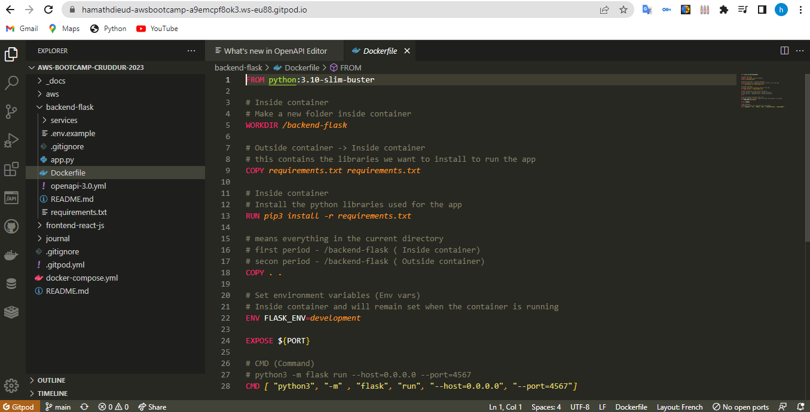
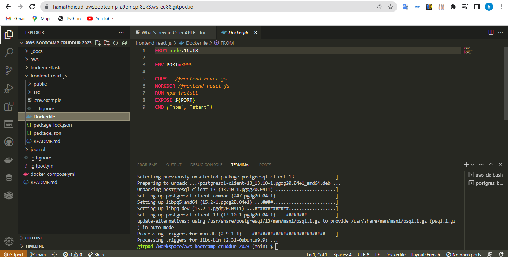
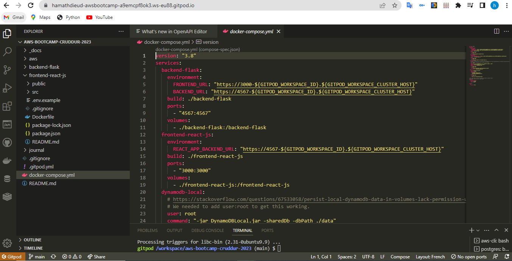
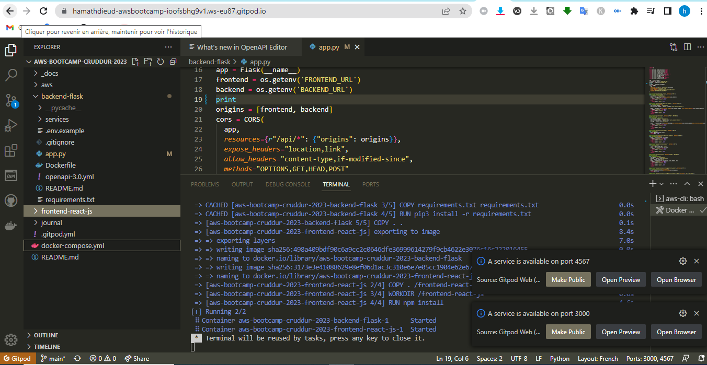
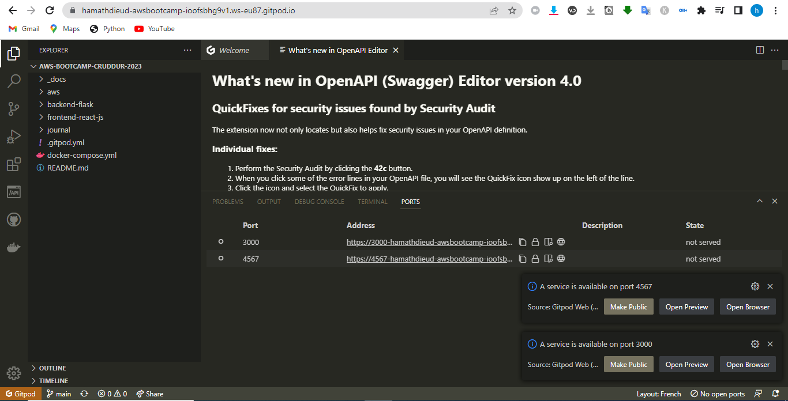
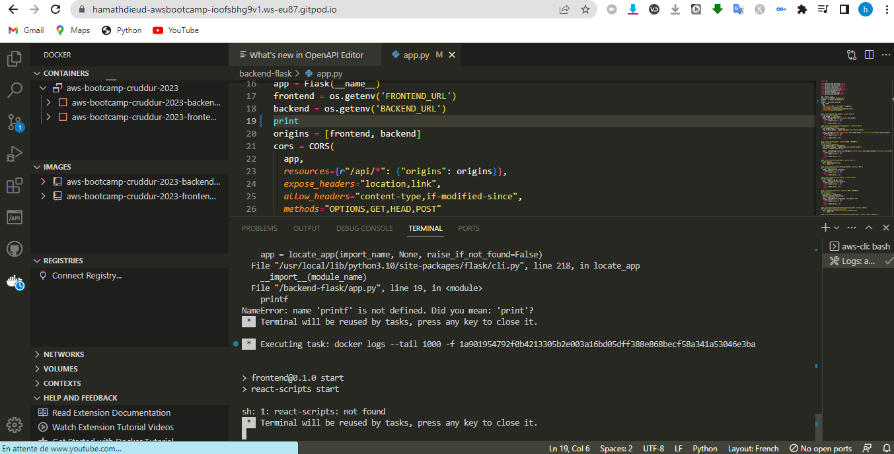
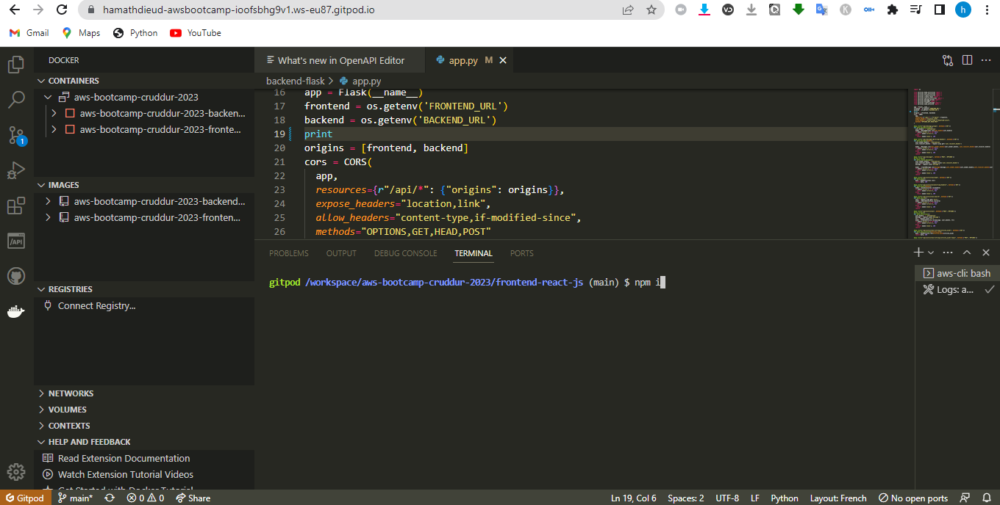
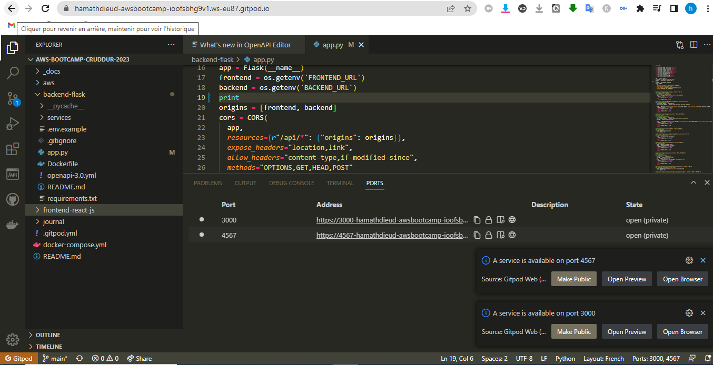

# Week 1 — App Containerization


## Technical Tasks
In this class, we are going to:
- Create a new GitHub repo
- Launch the repo within a Gitpod workspace
- Configure Gitpod.yml configuration, eg. VSCode Extensions
- Clone the frontend and backend repo
- Explore the codebases
- Ensure we can get the apps running locally
- Write a Dockerfile for each app
- Ensure we get the apps running via individual container
- Create a docker-compose file
- Ensure we can orchestrate multiple containers to run side by side
- Mount directories so we can make changes while we code

## Business Scenario
Your company has received the code repositories for the demo application from the contracted web-development firm. The company wants you to investigate the codebases, and ensure you can get them running.

The fractional CTO has suggested we first begin containerizing the applications for both developer and production use, and their reasons stayed why:
- To avoid lack of documentation of application and OS configuration
- To ensure the effort of application and OS configuration is factored in before investing lots of feature development
- If we decide to hire our technical team members we can quickly replicate these environments in any preferred choice.

The fractional CTO has asked that everything be developed in Gitpod, (a Cloud Developer Environment). This will allow the CTO at a press of a button launch the developer environment in a clean state to help with any tricky or emergency implementations, and ensure developer accountability.

Gitpod was since it supports multiple Version Control Services (VCS).. The company has invested considerable effort already in Atlassian JIRA working with the web-dev firm, and repo’s highly likely might be moved to Atlassian BitBucket to take advantage of better integrations within the Atlassian’s ecosystem.

## Containerize Backend

### Run Python
```python
cd backend-flask
export FRONTEND_URL="*"
export BACKEND_URL="*"
python3 -m flask run --host=0.0.0.0 --port=4567
cd ..
```

- make sure to unlock the port on the port tab
- open the link for 4567 in your browser
- append to the url to /api/activities/home
- you should get back json

### Add Dockerfile
Create a file here: ``backend-flask/Dockerfile``
```Dockerfile
FROM python:3.10-slim-buster

WORKDIR /backend-flask

COPY requirements.txt requirements.txt
RUN pip3 install -r requirements.txt

COPY . .

ENV FLASK_ENV=development

EXPOSE ${PORT}
CMD [ "python3", "-m" , "flask", "run", "--host=0.0.0.0", "--port=4567"]
```



### Build Container
```
docker build -t  backend-flask ./backend-flask
```
### Run Container
Run
```python
docker run --rm -p 4567:4567 -it backend-flask
FRONTEND_URL="*" BACKEND_URL="*" docker run --rm -p 4567:4567 -it backend-flask
export FRONTEND_URL="*"
export BACKEND_URL="*"
docker run --rm -p 4567:4567 -it -e FRONTEND_URL='*' -e BACKEND_URL='*' backend-flask
docker run --rm -p 4567:4567 -it  -e FRONTEND_URL -e BACKEND_URL backend-flask
unset FRONTEND_URL="*"
unset BACKEND_URL="*"
```

## Containerize Frontend

### Run NPM Install
We have to run NPM Install before building the container since it needs to copy the contents of node_modules
```
cd frontend-react-js
npm i
```
### Create Docker File
Create a file here: ``frontend-react-js/Dockerfile``
```Dockerfile
FROM node:16.18

ENV PORT=3000

COPY . /frontend-react-js
WORKDIR /frontend-react-js
RUN npm install
EXPOSE ${PORT}
CMD ["npm", "start"]
```


### Build Container

``docker build -t frontend-react-js ./frontend-react-js``
### Run Container
``docker run -p 3000:3000 -d frontend-react-js``

## Multiple Containers
### Create a docker-compose file
Create ``docker-compose.yml`` at the root of your project.
```yml
version: "3.8"
services:
  backend-flask:
    environment:
      FRONTEND_URL: "https://3000-${GITPOD_WORKSPACE_ID}.${GITPOD_WORKSPACE_CLUSTER_HOST}"
      BACKEND_URL: "https://4567-${GITPOD_WORKSPACE_ID}.${GITPOD_WORKSPACE_CLUSTER_HOST}"
    build: ./backend-flask
    ports:
      - "4567:4567"
    volumes:
      - ./backend-flask:/backend-flask
  frontend-react-js:
    environment:
      REACT_APP_BACKEND_URL: "https://4567-${GITPOD_WORKSPACE_ID}.${GITPOD_WORKSPACE_CLUSTER_HOST}"
    build: ./frontend-react-js
    ports:
      - "3000:3000"
    volumes:
      - ./frontend-react-js:/frontend-react-js

# the name flag is a hack to change the default prepend folder
# name when outputting the image names
networks: 
  internal-network:
    driver: bridge
    name: cruddur
```



``docker-compose up``


 
### I have encountered a few errors
After running "docker-compose", my ports should be open, but they are not. There must be a problem.



So I went to see the logs and indeed there was a problem.


The first error comes from "app.py" at line 19 (printf) which must be deleted or remove the "f".


The other error was that I did not execute npm install (npm i) in frontend-react-js.



```
cd frontend-react-js
npm i
```


Now we can run "docker-compse up" and we can see that our ports are available and open. Make sure to unlock the port in the port tab.



## Adding DynamoDB Local and Postgres
We are going to use Postgres and DynamoDB local in future labs We can bring them in as containers and reference them externally

Lets integrate the following into our existing docker compose file:

### Postgres
```yml
services:
  db:
    image: postgres:13-alpine
    restart: always
    environment:
      - POSTGRES_USER=postgres
      - POSTGRES_PASSWORD=password
    ports:
      - '5432:5432'
    volumes: 
      - db:/var/lib/postgresql/data
volumes:
  db:
    driver: local
```
To install the postgres client into Gitpod
```yml
  - name: postgres
    init: |
      curl -fsSL https://www.postgresql.org/media/keys/ACCC4CF8.asc|sudo gpg --dearmor -o /etc/apt/trusted.gpg.d/postgresql.gpg
      echo "deb http://apt.postgresql.org/pub/repos/apt/ `lsb_release -cs`-pgdg main" |sudo tee  /etc/apt/sources.list.d/pgdg.list
      sudo apt update
      sudo apt install -y postgresql-client-13 libpq-dev
```
### DynamoDB Local
```
services:
  dynamodb-local:
    # https://stackoverflow.com/questions/67533058/persist-local-dynamodb-data-in-volumes-lack-permission-unable-to-open-databa
    # We needed to add user:root to get this working.
    user: root
    command: "-jar DynamoDBLocal.jar -sharedDb -dbPath ./data"
    image: "amazon/dynamodb-local:latest"
    container_name: dynamodb-local
    ports:
      - "8000:8000"
    volumes:
      - "./docker/dynamodb:/home/dynamodblocal/data"
    working_dir: /home/dynamodblocal
```
Example of using DynamoDB local https://github.com/100DaysOfCloud/challenge-dynamodb-local

### Volumes
directory volume mapping
```
volumes: 
- "./docker/dynamodb:/home/dynamodblocal/data"
```
named volume mapping
```
volumes: 
  - db:/var/lib/postgresql/data

volumes:
  db:
    driver: local
```
