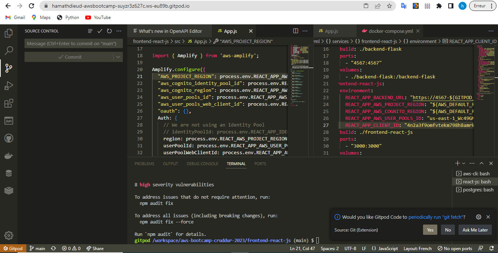
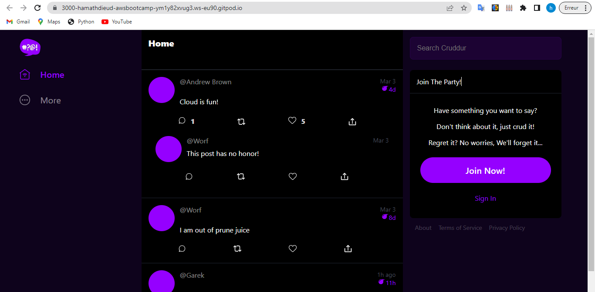

# Week 3 — Decentralized Authentication

## Cognito

### Create a user pool


Inside our ``HomeFeedPage.js``
```js
import { Auth } from 'aws-amplify';

// set a state
const [user, setUser] = React.useState(null);

// check if we are authenicated
const checkAuth = async () => {
  Auth.currentAuthenticatedUser({
    // Optional, By default is false. 
    // If set to true, this call will send a 
    // request to Cognito to get the latest user data
    bypassCache: false 
  })
  .then((user) => {
    console.log('user',user);
    return Auth.currentAuthenticatedUser()
  }).then((cognito_user) => {
      setUser({
        display_name: cognito_user.attributes.name,
        handle: cognito_user.attributes.preferred_username
      })
  })
  .catch((err) => console.log(err));
};

// check when the page loads if we are authenicated
React.useEffect(()=>{
  loadData();
  checkAuth();
}, [])
```

### Signin Page

```js
import { Auth } from 'aws-amplify';

const [cognitoErrors, setCognitoErrors] = React.useState('');

const onsubmit = async (event) => {
  setCognitoErrors('')
  event.preventDefault();
  try {
    Auth.signIn(username, password)
      .then(user => {
        localStorage.setItem("access_token", user.signInUserSession.accessToken.jwtToken)
        window.location.href = "/"
      })
      .catch(err => { console.log('Error!', err) });
  } catch (error) {
    if (error.code == 'UserNotConfirmedException') {
      window.location.href = "/confirm"
    }
    setCognitoErrors(error.message)
  }
  return false
}

let errors;
if (cognitoErrors){
  errors = <div className='errors'>{cognitoErrors}</div>;
}

// just before submit component
{errors}
```

### Signup Page
```js
import { Auth } from 'aws-amplify';

const [cognitoErrors, setCognitoErrors] = React.useState('');

const onsubmit = async (event) => {
  event.preventDefault();
  setCognitoErrors('')
  try {
      const { user } = await Auth.signUp({
        username: email,
        password: password,
        attributes: {
            name: name,
            email: email,
            preferred_username: username,
        },
        autoSignIn: { // optional - enables auto sign in after user is confirmed
            enabled: true,
        }
      });
      console.log(user);
      window.location.href = `/confirm?email=${email}`
  } catch (error) {
      console.log(error);
      setCognitoErrors(error.message)
  }
  return false
}

let errors;
if (cognitoErrors){
  errors = <div className='errors'>{cognitoErrors}</div>;
}

//before submit component
{errors}
```

### Confirmation Page
```js
const resend_code = async (event) => {
  setCognitoErrors('')
  try {
    await Auth.resendSignUp(email);
    console.log('code resent successfully');
    setCodeSent(true)
  } catch (err) {
    // does not return a code
    // does cognito always return english
    // for this to be an okay match?
    console.log(err)
    if (err.message == 'Username cannot be empty'){
      setCognitoErrors("You need to provide an email in order to send Resend Activiation Code")   
    } else if (err.message == "Username/client id combination not found."){
      setCognitoErrors("Email is invalid or cannot be found.")   
    }
  }
}

const onsubmit = async (event) => {
  event.preventDefault();
  setCognitoErrors('')
  try {
    await Auth.confirmSignUp(email, code);
    window.location.href = "/"
  } catch (error) {
    setCognitoErrors(error.message)
  }
  return false
}
```



### Recovery Page
```js
import { Auth } from 'aws-amplify';

const onsubmit_send_code = async (event) => {
  event.preventDefault();
  setCognitoErrors('')
  Auth.forgotPassword(username)
  .then((data) => setFormState('confirm_code') )
  .catch((err) => setCognitoErrors(err.message) );
  return false
}

const onsubmit_confirm_code = async (event) => {
  event.preventDefault();
  setCognitoErrors('')
  if (password == passwordAgain){
    Auth.forgotPasswordSubmit(username, code, password)
    .then((data) => setFormState('success'))
    .catch((err) => setCognitoErrors(err.message) );
  } else {
    setCognitoErrors('Passwords do not match')
  }
  return false
}
```


### Authenticating Server Side

Add in the `HomeFeedPage.js` a header eto pass along the access token

```js
  headers: {
    Authorization: `Bearer ${localStorage.getItem("access_token")}`
  }
```
In the ``app.py``

```py
cors = CORS(
  app, 
  resources={r"/api/*": {"origins": origins}},
  headers=['Content-Type', 'Authorization'], 
  expose_headers='Authorization',
  methods="OPTIONS,GET,HEAD,POST"
)
```

### Improving UI contraste and implementing CSS variables for theming


